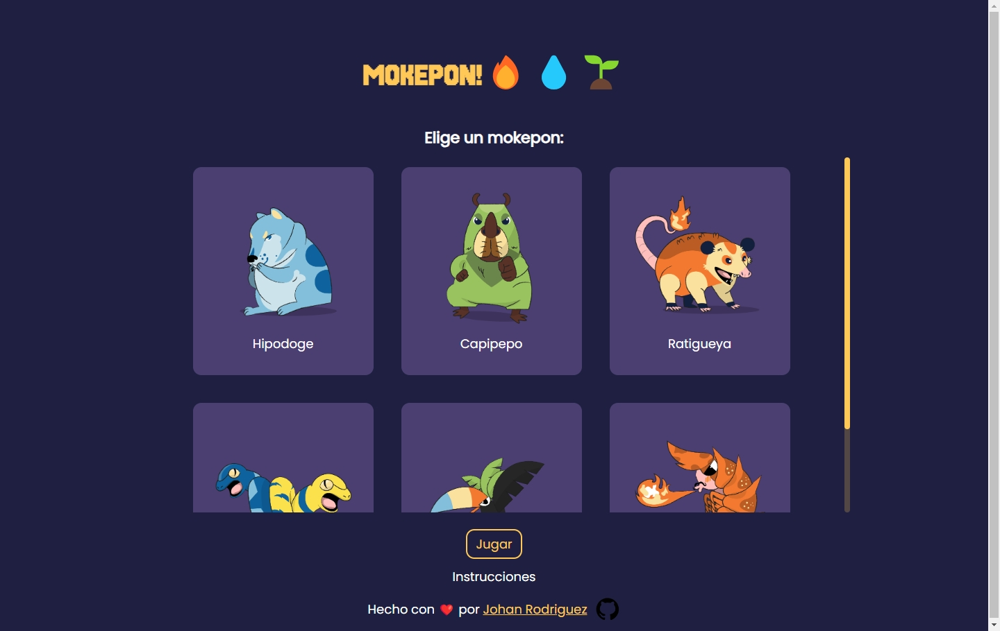
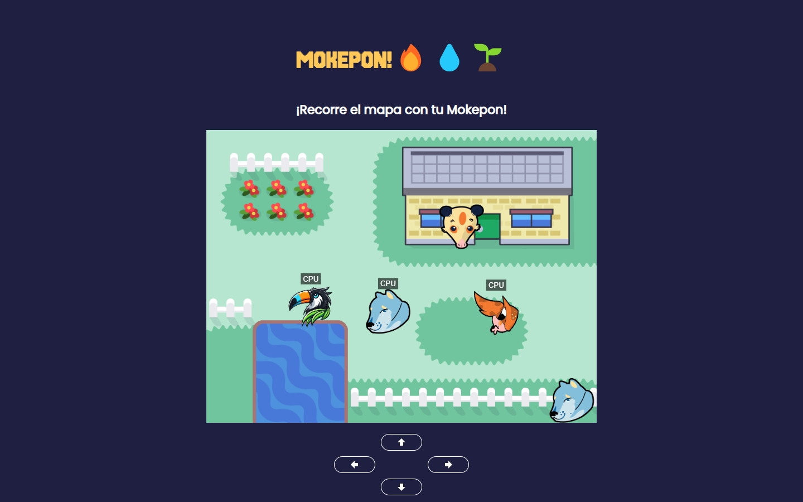
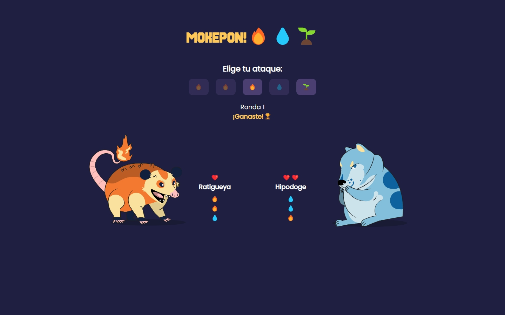

# Mokepon Game

A web video game inspired by Pokemon 🎮 as a final project of the basic programming course on Platzi 💚

## Table of contents

- [Mokepon Game](#mokepon-game)
  - [Overview](#overview)
    - [About the game](#about-the-game)
    - [Key features](#key-features)
    - [Screenshots](#screenshots)
    - [Links](#links)
  - [My process](#my-process)
    - [Built with](#built-with)
    - [What I learned](#what-i-learned)
    - [Continued development](#continued-development)
    - [Useful resources](#useful-resources)
  - [Installation](#installation)
    - [Prerequisites](#prerequisites)
    - [Setting up locally](#setting-up-locally)
  - [Author](#author)
  - [Acknowledgments](#acknowledgments)

## Overview

### About the game

Mokepon is a turn-based combat game where players can choose their pet monster (Mokepon) and battle against CPU-controlled opponents or other players. The game draws inspiration from popular monster-battling games but with its own unique twist.

Each Mokepon has a specific element type (water, fire, or plant) which determines its strengths and weaknesses in battle. Players navigate their Mokepon through a map, encounter opponents, and engage in elemental combat using strategic attacks.

### Key features

- Select from 6 unique Mokepons, each with their own element type
- Real-time movement on a 2D map
- Turn-based combat system with elemental advantages
- Multiplayer support (battle against CPU or other players)
- Responsive design that works on desktop and mobile devices
- Strategic combat mechanics where element types matter
- Visual feedback during battles with emoji-based attacks

### Screenshots





### Links

- Live Site URL: [Mokepon Game](https://mokepon-ed1d40aff3a6.herokuapp.com/)

## My process

### Built with

- Semantic HTML5 markup
- CSS custom properties and modern features
- Flexbox and CSS Grid
- Mobile-first workflow
- Vanilla JavaScript
- Canvas API for game rendering
- Node.js and Express for backend
- RESTful API principles

### What I learned

During this project, I strengthened my understanding of:

- Game development concepts using vanilla JavaScript
- Canvas manipulation for 2D graphics
- Real-time multiplayer functionality
- State management without frameworks
- Server-client communication
- Responsive design for games
- Creating engaging user interfaces
- Deploying Node applications to Heroku

### Continued development

Areas I want to continue focusing on in future projects:

- Implementing more advanced game mechanics
- Adding user authentication
- Persistent game data with databases or local storage
- Optimizing performance for larger scale games
- Adding more animation and visual effects
- Optimizing images and assets for faster loading times and better quality
- Exploring techniques like WebSockets for real-time multiplayer interactions

### Useful resources

- [MDN Web Docs](https://developer.mozilla.org) - Comprehensive documentation for web technologies
- [Beacon API](https://developer.mozilla.org/en-US/docs/Web/API/Beacon_API) - API for sending data to a server asynchronously
- [Express npm package](https://www.npmjs.com/package/express) - Fast, unopinionated, minimalist web framework for Node.js
- [Lucide Icons](https://lucide.dev/) - A collection of open-source icons for use in web projects

## Installation

### Prerequisites

- Node.js (v14 or higher)

### Setting up locally

1. Clone the repository:

   ```bash
   git clone https://github.com/jdrodriguez2707/mokepon-game.git
   cd mokepon-game
   ```

2. Install dependencies:

   ```bash
   npm install
   ```

3. Start the development server:

   ```bash
   npm start
   ```

4. Open your browser and navigate to `http://localhost:3000`

## Author

- Social links - [Johan Rodriguez](https://jdrodriguez2707.github.io/social-links-profile/)
- GitHub - [@jdrodriguez2707](https://github.com/jdrodriguez2707)

## Acknowledgments

This project was made possible thanks to the [Curso Gratis de Programación Básica](https://platzi.com/cursos/programacion-basica/) from Platzi. The course provided the foundation and inspiration for building this game, while I added my own enhancements and features to expand upon the original concept.

Special thanks to the instructors for the clear explanations and guidance throughout the course, which made this learning experience enjoyable and productive.
